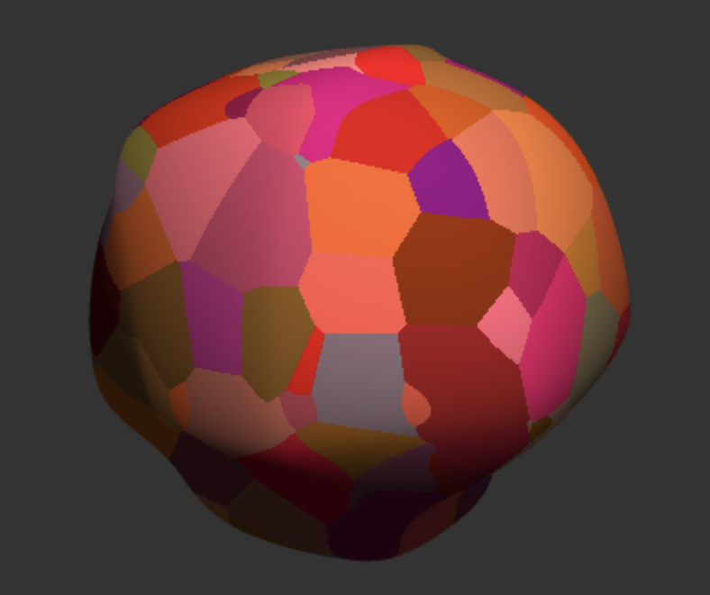
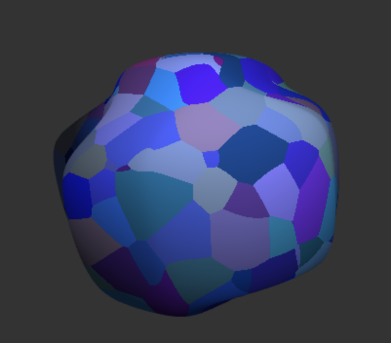
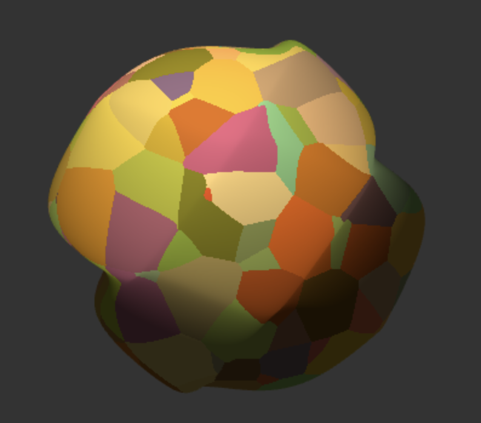
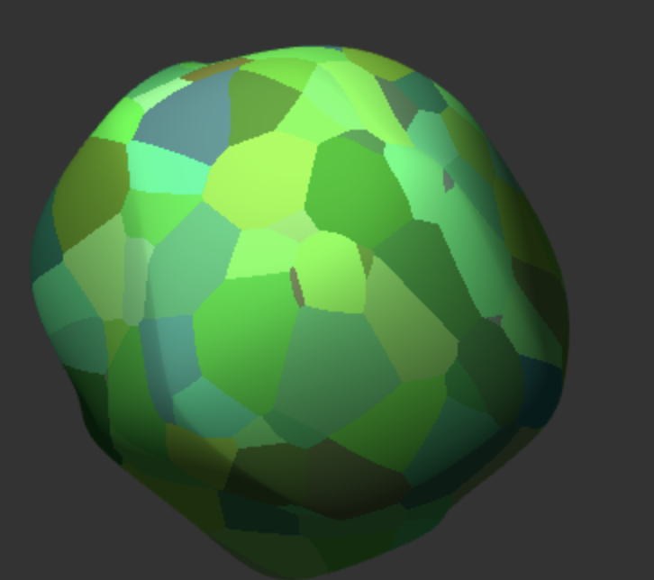

# HW 0: Intro to Javascript and WebGL

## Project Description
In this project I implemented a shader-based cube using Javascript and WebGL. I began by creating a drawable cube and added a color picker through dat.GUI so users can adjust the cube's diffuse color in real time. I then implemented 3D Worley noise in a fragment shader to create Voronoi-like cells and blended their generated colors together with the selected diffuse color. Additionally, I created a vertex shader that uses a time variable, u_Time, and sin functions to animate the base cube's vertices. This distortion also makes the cube pass through different voronoi cells over time creating a more dynamic visual effect. I then published my code to GitHub Pages where it can be viewed as a live demo [here](https://mhedlund7.github.io/hw00-intro-base/).

## Additional Images:
||||
|:--:|:--:|:--:|
|Worley Noise Blue Cube|Worley Noise Yellow Cube|Worley Noise Green Cube|